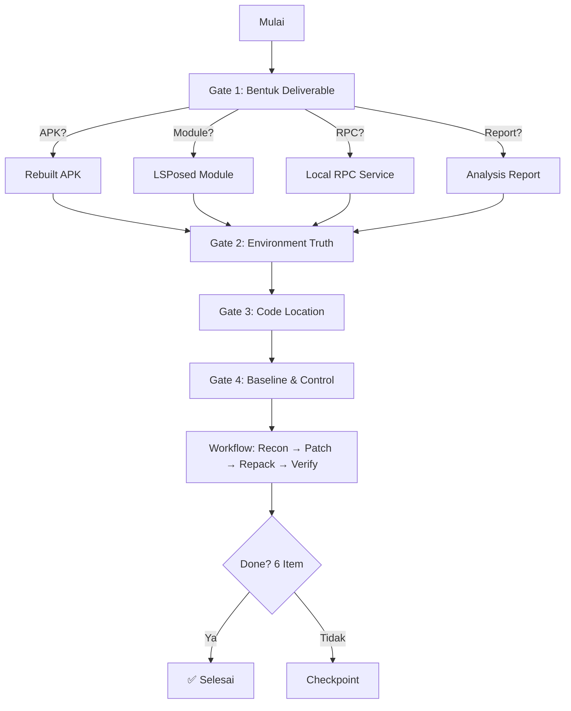

<p align="center">
  <picture>
    <source media="(prefers-color-scheme: dark)" srcset="assets/banner-dark.svg">
    
  </picture>
</p>

<p align="center">
  <a href="README.md">English</a> · <a href="README.zh-CN.md">简体中文</a> · <b>Bahasa Indonesia</b>
</p>

<p align="center">
  <a href="https://github.com/newliver666/apk-reverse/stargazers"></a>
  <a href="https://github.com/newliver666/apk-reverse/network/members"></a>
  <a href="LICENSE"></a>
  
  
</p>

# apk-reverse

> 🛠️ **Dimodifikasi oleh ALDY** — Penambahan runner npx, modul web reverse engineering, dan penyempurnaan tooling.

Sebuah **Agent Skill** untuk reverse engineering APK Android, debloating, penghapusan iklan,
patching DEX bedah, repacking, dan analisis runtime/server.

Ini adalah **skill**, bukan tutorial: dirancang untuk dimuat oleh agen AI (Claude Code, Codex,
Google Antigravity IDE, atau harness mana pun yang mendukung format Agent Skills) saat bekerja.
Terstruktur untuk progressive disclosure — `SKILL.md` pendek berorientasi keputusan, referensi
detail dimuat hanya saat diperlukan, dan skrip ter-parameterisasi yang bisa dijalankan langsung.

---

## ⚡ Mulai Cepat

```bash
# 1. Clone
git clone https://github.com/newliver666/apk-reverse.git
cd apk-reverse

# 2. Setup otomatis (periksa & install semuanya)
python setup.py

# 3. Periksa lingkungan
python apk_cli.py doctor

# 4. Mulai analisis
python apk_cli.py recon --apk target.apk

# 5. Generate laporan
python apk_cli.py report --apk target.apk --format html --out report.html
```

Untuk panduan lengkap langkah demi langkah, baca [`references/panduan-cepat.md`](skills/apk-reverse/references/panduan-cepat.md).

---

## 🛠️ Instalasi & Penggunaan

### 1. Langsung via npx (NPM Registry)
Tidak perlu install apapun, langsung jalankan dari terminal:
```bash
npx @aldy11/apk-reverse doctor
npx @aldy11/apk-reverse recon --apk target.apk
npx @aldy11/apk-reverse --skills
```

### 2. Pasang ke AI Agent (Antigravity IDE, Claude Code, Cursor)
```bash
npx skills add ALDY711/apk-reverse-modifikasi
```

### 3. Manual (Python)
```bash
git clone https://github.com/ALDY711/apk-reverse-modifikasi.git
cd apk-reverse-modifikasi
pip install -r requirements.txt
python setup.py
```

### Di Google Antigravity IDE
```
# Sebagai workspace skill:
Salin skills/apk-reverse/ ke .agents/skills/apk-reverse/ di folder proyek Anda.

# Atau sebagai global skill:
Salin skills/apk-reverse/ ke ~/.gemini/config/skills/apk-reverse/
```

---

## ✨ Kemampuan Utama

| Kategori | Kemampuan |
|---|---|
| 🔍 **Rekon** | Identifikasi packer, SDK, lokasi kode, pemeriksaan tamper |
| 🔧 **Patching** | Byte-level DEX edit, string patch, native .so patch, method rewrite |
| 📦 **Repack** | Align, sign ulang, handle split APK, preservasi metadata ZIP |
| 🛡️ **Keamanan** | Scan kebocoran data, TLS/cert analysis, signature verification |
| 🔬 **Dinamis** | Frida probe/hook/RPC/Stalker, memory DEX dump, cold-start analysis |
| 📱 **Device** | Preflight check, install & test, screenshot otomatis |
| 📊 **Laporan** | Generate laporan MD/HTML/JSON dengan penilaian risiko |
| 🧩 **Advanced** | VMP differential, Java2C detection, kernel-level analysis |
| 🌐 **Web Reverse** | Ekstraksi Source Map, deobfuskasi JS, netralkan anti-debug, tracing API, Userscript & proxy |

---

## 📂 Struktur Proyek

```
apk-reverse/
├── apk_cli.py              ← CLI terpadu (titik masuk utama)
├── setup.py                ← Skrip instalasi otomatis
├── requirements.txt        ← Dependensi Python
├── config.example.yaml     ← Template konfigurasi
├── CHANGELOG.md            ← Catatan perubahan
│
├── skills/
│   ├── apk-reverse/            ← Skill utama reverse engineering & patching
│   │   ├── SKILL.md            ← Prosedur 4 gate + symptom index
│   │   ├── scripts/            ← 63 skrip otomasi
│   │   ├── references/         ← 46 dokumen referensi teknis
│   │   └── evals/ & evidence/  ← Evaluasi dan bukti kapabilitas
│   ├── frida-dynamic-toolkit/  ← Skill instrumentasi & hook Frida
│   │   ├── SKILL.md            ← Prosedur dynamic instrumentation
│   │   ├── scripts/            ← Bypass generator, crypto monitor, JNI hook
│   │   └── references/         ← Matriks SSL unpinning & root detection
│   ├── apk-debloater/          ← Skill pembersihan iklan & telemetry
│   │   ├── SKILL.md            ← Prosedur manifest neutering & stubbing
│   │   ├── scripts/            ← Manifest scanner & smali stub generator
│   │   └── references/         ← Katalog signature iklan & teknik neutering
│   └── apk-mitm-patcher/       ← Skill intersepsi HTTPS & Network Security Config
│       ├── SKILL.md            ← Prosedur injeksi user CA & bypass cleartext
│       ├── scripts/            ← NSC patcher & cert inspector
│       └── references/         ← Spesifikasi XML NSC & troubleshooting proxy
│
├── tests/                  ← Unit & integration tests
├── docs/                   ← Verifikasi tool
├── assets/                 ← Banner SVG
└── .github/workflows/      ← CI/CD
```

---

## 🎯 Cara Kerja (4 Gate)



**Aturan utama:**
1. **R1** — Tulis deliverable sebagai kalimat yang bisa diuji
2. **R2** — Ubah satu variabel saja, selalu punya control build
3. **R3** — Jangan klaim selesai tanpa verifikasi langsung
4. **R4** — Identifikasi layer yang benar sebelum patch

---

## 📋 Perintah CLI

```bash
# Lingkungan
python apk_cli.py doctor                    # Cek kesehatan lingkungan
python apk_cli.py doctor --json             # Output JSON

# Rekon
python apk_cli.py recon --apk target.apk    # Rekon lengkap
python apk_cli.py strings target.apk        # Ekstrak string

# Patching
python apk_cli.py patch dex-bytes ...       # Patch byte-level
python apk_cli.py patch dex-string ...      # Patch string
python apk_cli.py patch native ...          # Patch .so
python apk_cli.py patch find-insn ...       # Cari instruksi

# Repack & Verifikasi
python apk_cli.py repack --apk ... --out .. # Repack APK
python apk_cli.py verify --apk ...          # Verifikasi di device

# Scanning
python apk_cli.py scan leaks ./project      # Scan kebocoran
python apk_cli.py scan tls target.apk       # Cek TLS/cert
python apk_cli.py scan signatures target.apk # Analisis signature

# Frida
python apk_cli.py frida probe com.app       # Universal probe
python apk_cli.py frida spawn com.app       # Spawn-patch-detach
python apk_cli.py frida rpc com.app         # RPC server

# Laporan
python apk_cli.py report --apk target.apk --format html --output report.html

# HTTPS MITM & Network Security Config
python apk_cli.py mitm --apk target.apk --inspect-only
python apk_cli.py mitm --export-frida ssl_unpin.js

# Debloat & Neuter Iklan/Telemetry
python apk_cli.py debloat --target ./unpacked --scan
python apk_cli.py debloat --target ./unpacked --neuter

# Generator Script Frida (Unpin, Root, Crypto)
python apk_cli.py frida-gen --template ssl-unpin --out bypass.js
python apk_cli.py frida-gen --template crypto-monitor --out crypto.js

# Native JNI Symbol Resolver & Hook Generator
python apk_cli.py jni --so libnative.so --generate-hooks --out hook.js

# Web Reverse
python apk_cli.py web sourcemap --url https://target.com/app.min.js --out-dir ./src
python apk_cli.py web api-tracer --file ./src/app.js --json
python apk_cli.py web deobf --file bundle.min.js --output bundle.clean.js
python apk_cli.py web userscript --domain target.com --template bypass-anti-debug
python apk_cli.py web serve --port 8080 --map-local "/app.js=./clean.js"

# Info
python apk_cli.py list                      # Daftar semua skrip
python apk_cli.py --help                    # Bantuan umum
```

---

## 📝 Prasyarat

| Tool | Wajib? | Kegunaan |
|---|---|---|
| Python 3.9+ | ✅ Ya | Runtime skrip |
| Java JDK 11+ | ⚠️ Untuk signing | Signing APK |
| adb | ⚠️ Untuk device | Komunikasi device |
| jadx | 💡 Opsional | Decompiler visual |
| apktool | 💡 Opsional | Disassembly/reassembly |
| zipalign | ⚠️ Untuk repack | Alignment APK |
| apksigner | ⚠️ Untuk repack | Signing v2/v3 |
| Frida | 💡 Opsional | Analisis dinamis |

---

## 📜 Lisensi & Kredit

[MIT](LICENSE) — lihat file LICENSE di root repository.
Dimodifikasi dan disempurnakan oleh **ALDY**.

---

## ⚠️ Disclaimer

Proyek ini ditujukan **semata-mata untuk tujuan edukasi dan penelitian keamanan**.
Penggunaan untuk melanggar hak cipta, memodifikasi aplikasi tanpa izin, atau aktivitas
ilegal lainnya **bukan tanggung jawab pembuat** dan **bertentangan dengan tujuan proyek ini**.

Gunakan secara bertanggung jawab sesuai hukum yang berlaku di wilayah Anda.
