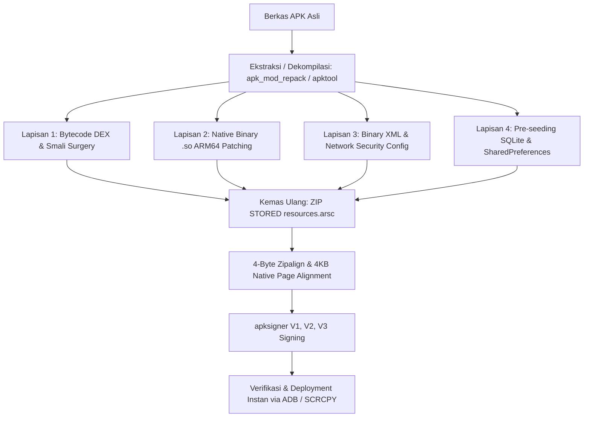

# APK Repacker & Deep Internals Modification Pipeline

Skill komprehensif untuk membongkar, memodifikasi hingga ke struktur terdalam (*bytecode DEX*, *smali*, pustaka *native C/C++ .so*, *Binary XML*, dan *database*), mengemas ulang ke arsip ZIP berstandar Android, menyelaraskan memori (*4-byte zipalign* & *4KB page alignment*), serta menandatangani APK dengan skema V1, V2, dan V3 agar 100% siap diinstal di Android 7.0 hingga 15.

---

## 1. Alur Kerja Modifikasi Mendalam (Deep Internals)



### Panduan Bedah Setiap Lapisan:
1. **Lapisan 1: DEX Bytecode & Smali Surgery**:
   - Membalikkan logika pengecekan (`if-eqz` menjadi `if-nez` atau `goto`).
   - Membajak *return value* method (`return v0` dengan `const/4 v0, 0x1` untuk bypass validasi).
   - Melakukan *in-place string patching* sama panjang tanpa dekompilasi via `dex_strpatch.py`.
   - Menghitung ulang integritas header DEX (urutan wajib: SHA-1 Signature di `0x0C` lalu Adler32 Checksum di `0x08`).
   - Detail: `references/deep-internals-and-smali-surgery.md`.

2. **Lapisan 2: Native Library `.so` (C/C++ / ARM64)**:
   - Patching instruksi assembly ARM64:
     - `1F 20 03 D5` (`NOP` - lewati instruksi).
     - `20 00 80 D2 C0 03 5F D6` (`MOV X0, #1; RET` - paksa return true).
     - `00 00 80 D2 C0 03 5F D6` (`MOV X0, #0; RET` - paksa return 0/sukses).
   - Hindari menimpa fungsi terminasi (`exit`/`abort`) dengan loop tak berujung untuk mencegah deadlock mutex thread.

3. **Lapisan 3: Network Security Config (Universal MITM)**:
   - Suntikkan `res/xml/network_security_config.xml` untuk mempercayai User CA dan mengizinkan traffic cleartext HTTP.
   - Sambungkan tag `android:networkSecurityConfig="@xml/network_security_config"` pada `<application>` di `AndroidManifest.xml`.

4. **Lapisan 4: Pra-Inisialisasi Database & Konfigurasi**:
   - Sertakan berkas konfigurasi bawaan atau database SQLite awal di folder `assets/`.
   - Pasang bootstrapper di kelas `Application` smali untuk menyalin database ke `/data/data/<pkg>/databases/` saat peluncuran perdana.

---

## 2. Alur Kerja Pengemasan, Penyelarasan & Penandatanganan

### Perintah Utama:
```bash
# 1. Pipeline otomatis All-in-One (Unpack, Modif, Zipalign, Sign):
python skills/apk-reverse/scripts/apk_mod_repack.py auto --apk original.apk --out modified_ready.apk --cleartext --trust-user-ca

# 2. Kemas direktori hasil modifikasi manual menjadi APK:
python skills/apk-repacker/scripts/repack_pipeline.py --dir ./unpacked_dir --out ./ready.apk

# 3. Verifikasi signature sebelum dipasang ke perangkat:
python skills/apk-repacker/scripts/apk_signer.py --verify ./ready.apk
```

---

## 3. Aturan Krusial Mencegah Kegagalan Repack

| Aturan | Dampak Jika Dilanggar | Solusi Standar |
|---|---|---|
| **`resources.arsc` wajib STORED** | Error `INSTALL_FAILED_INVALID_APK` atau `[-124]`. | Gunakan flag `ZIP_STORED` (tanpa kompresi). |
| **Penyelarasan 4-Byte (Zipalign)** | Aplikasi ditolak oleh Play Services dan Package Manager. | Jalankan `zipalign -f -p 4 input.apk aligned.apk`. |
| **Skema Signature V2 & V3 Wajib** | Error `INSTALL_PARSE_FAILED_NO_CERTIFICATES` di Android 11+. | Gunakan `apksigner` dengan flag `--v2-signing-enabled true --v3-signing-enabled true`. |
| **Bersihkan `META-INF` Lama** | Konflik tanda tangan dan kegagalan verifikasi digest. | Hapus seluruh file `*.SF`, `*.RSA`, `*.DSA`, `*.EC`, dan `MANIFEST.MF` sebelum sign ulang. |

---

## 4. Penanganan Masalah & Troubleshooting

Jika terjadi kendala instalasi atau aplikasi tertutup sendiri (*force close*):
- Pelajari panduan solusi 10 error instalasi umum di **`references/troubleshooting-repack-install-failures.md`**.
- Pahami detail perbedaan skema penandatanganan di **`references/apk-signing-schemes.md`**.
- Pahami batas memori dan arsitektur kompresi di **`references/zipalign-and-compression.md`**.

---

## 5. Indeks Referensi

Lihat inventaris lengkap modul, skrip, dan referensi di **`references/routing.md`**.
