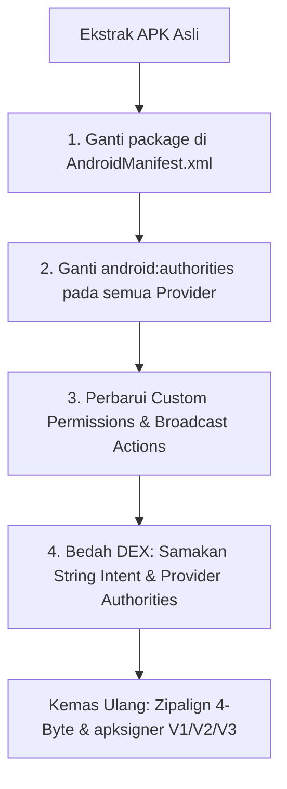

# Panduan Kloning Aplikasi & Pembuatan Dual-App (App Duplication)

Panduan teknis memodifikasi berkas APK agar dapat dipasang berdampingan (*side-by-side*) dengan aplikasi aslinya di satu perangkat Android yang sama tanpa saling menimpa (*dual app / app clone*).

---

## 1. Masalah Konflik Paket di Android Package Manager

Android melarang dua aplikasi dengan `package` name yang sama atau memiliki `ContentProvider` dengan `authorities` yang sama terpasang secara bersamaan:

1. **Konflik Package Name**: Memasang APK dengan nama paket yang sama akan memicu pembaruan (*upgrade*), bukan instalasi baru. Jika signature berbeda, sistem melempar error `INSTALL_FAILED_UPDATE_INCOMPATIBLE`.
2. **Konflik ContentProvider**: Jika nama paket sudah diubah tetapi ada tag `<provider>` yang masih menggunakan authority lama, instalasi akan ditolak dengan error:
   ```text
   Failure [INSTALL_FAILED_CONFLICTING_PROVIDER: ... conflicts with existing package ...]
   ```

---

## 2. Prosedur 4 Langkah Kloning APK Sempurna



### Langkah 1: Ubah Atribut `package` di Manifest
Buka `AndroidManifest.xml`, cari tag root `<manifest>`:
```xml
<!-- SEBELUM: -->
<manifest xmlns:android="http://schemas.android.com/apk/res/android"
    package="com.target.application">

<!-- SESUDAH (tambahkan sufiks unik): -->
<manifest xmlns:android="http://schemas.android.com/apk/res/android"
    package="com.target.application.clone">
```

### Langkah 2: Ubah Seluruh `android:authorities` pada `<provider>`
Setiap penyedia konten internal (misal FileProvider, InitProvider, SQLiteProvider) wajib memiliki otoritas unik:
```xml
<!-- SEBELUM: -->
<provider
    android:name="androidx.core.content.FileProvider"
    android:authorities="com.target.application.fileprovider"
    android:exported="false" />

<!-- SESUDAH: -->
<provider
    android:name="androidx.core.content.FileProvider"
    android:authorities="com.target.application.clone.fileprovider"
    android:exported="false" />
```

### Langkah 3: Perbarui Custom Permissions
Jika aplikasi mendeklarasikan izin kustom (misal untuk GCM / C2DM / sync):
```xml
<!-- SEBELUM: -->
<permission android:name="com.target.application.permission.C2D_MESSAGE" />
<uses-permission android:name="com.target.application.permission.C2D_MESSAGE" />

<!-- SESUDAH: -->
<permission android:name="com.target.application.clone.permission.C2D_MESSAGE" />
<uses-permission android:name="com.target.application.clone.permission.C2D_MESSAGE" />
```

### Langkah 4: Sinkronisasi String Authority di Dalam DEX
Banyak aplikasi menginisialisasi FileProvider dari kode Java/Kotlin:
`FileProvider.getUriForFile(context, "com.target.application.fileprovider", file);`

Gunakan `dex_strpatch.py` untuk mengganti string authority di dalam `classes.dex` agar sesuai dengan authority baru di manifest tanpa mengubah panjang byte (gunakan spasi atau karakter pengganti yang proporsional jika perlu, atau gunakan smali replacement).

---

## 3. Otomatisasi via Toolkit

Gunakan script `apk_patcher_studio.py` untuk memindai dan mengotomatisasi pipeline kloning:
```powershell
python skills/apk-reverse/scripts/apk_patcher_studio.py patch --apk original.apk --out original_clone.apk
```
Setelah APK kloning terbentuk, aplikasi dapat dipasang menggunakan ADB:
```powershell
adb install -r original_clone.apk
```
Aplikasi klon dan aplikasi asli kini akan muncul berdampingan di layar menu ponsel Anda!
