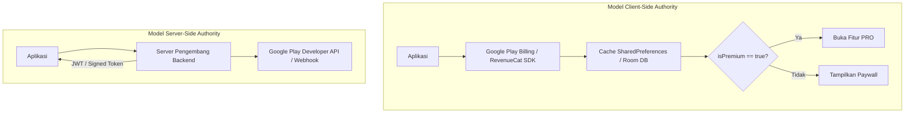

# Panduan Bypass Lisensi, Langganan & Feature Gates Android

Panduan analisis dan rekayasa balik mekanisme pembelian dalam aplikasi (*In-App Purchases / IAP*), langganan berkala (*Subscriptions*), dan pembatasan fitur berbasis lisensi pada aplikasi Android.

---

## 1. Arsitektur Pembelian & Subscription di Android

Mekanisme validasi lisensi umumnya diimplementasikan melalui dua model:



### Kapan Patching Client-Side Pasti Berhasil?
- Aplikasi yang fiturnya berfungsi secara offline (editor video, pemutar musik, utilitas, kalkulator, tools grafis).
- Aplikasi yang menyimpan status langganan di memori lokal (*local state cache*).

### Kapan Diperlukan Mitigasi Server?
- Aplikasi berbasis cloud (streaming media berbayar, sinkronisasi cloud backend). Pada jenis ini, patch client-side hanya membuka tampilan antarmuka (UI cosmetic), sementara request data konten tetap ditolak server jika tidak memiliki token valid.

---

## 2. Bedah Smali: Google Play Billing Client (v3, v4, v5, v6, v7)

### A. Membajak Status Pembelian `Purchase.getPurchaseState()`
Di dalam `com/android/billingclient/api/Purchase`:
* `0`: `UNSPECIFIED_STATE`
* `1`: `PURCHASED` (Telah Dibeli / Sah)
* `2`: `PENDING`

```smali
# Bedah method getPurchaseState()I agar selalu mengembalikan 1 (PURCHASED):
.method public getPurchaseState()I
    .registers 2
    const/4 v0, 0x1
    return v0
.end method
```

### B. Membajak `Purchase.isAcknowledged()`
Google Play mewajibkan transaksi diakui (*acknowledged*) dalam 3 hari:
```smali
.method public isAcknowledged()Z
    .registers 2
    const/4 v0, 0x1
    return v0
.end method
```

---

## 3. Bedah Smali: SDK Subscription Pihak Ketiga

### A. RevenueCat SDK (`com.revenuecat.purchases`)
RevenueCat menggunakan kelas `EntitlementInfo` untuk menentukan apakah langganan aktif:
```smali
# Cari method: Lcom/revenuecat/purchases/EntitlementInfo;->isActive()Z
.method public final isActive()Z
    .registers 2
    const/4 v0, 0x1
    return v0
.end method
```

### B. Adapty SDK (`com.adapty`)
Adapty memeriksa `AdaptyProfile.AccessLevel.isActive`:
```smali
# Cari method: Lcom/adapty/models/AdaptyProfile$AccessLevel;->isActive()Z
.method public final isActive()Z
    .registers 2
    const/4 v0, 0x1
    return v0
.end method
```

### C. Qonversion SDK (`com.qonversion.android.sdk`)
```smali
# Cari method: Lcom/qonversion/android/sdk/dto/QPermission;->isActive()Z
.method public final isActive()Z
    .registers 2
    const/4 v0, 0x1
    return v0
.end method
```

---

## 4. Alur Kerja Pemindaian Otomatis via Toolkit

Gunakan toolkit `apk_patcher_studio.py` untuk mendeteksi method lisensi di seluruh file DEX tanpa dekompilasi manual:

```powershell
python skills/apk-reverse/scripts/apk_patcher_studio.py scan-gates --apk "path/ke/aplikasi.apk"
```

Output akan langsung menampilkan lokasi file DEX dan nama simbol verifikasi lisensi yang menjadi target empuk pembedahan bytecode!
