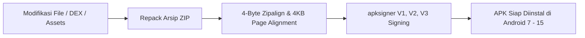

# Panduan Komprehensif Modifikasi & Rekayasa Balik APK Universal

Panduan ini berlaku untuk **seluruh jenis aplikasi dan game Android**, bukan hanya aplikasi pesan (WhatsApp):
- **Aplikasi Bisnis, Sosial & Utilitas** (Kotlin, Java, AndroidX)
- **Game Mobile** (Unity 3D, Unreal Engine, Cocos2d)
- **Aplikasi Multiplatform** (Flutter/Dart, React Native Hermes, Xamarin/.NET, Cordova/Capacitor)

---

## 1. Taksonomi Arsitektur Aplikasi Android & Pola Modifikasi

| Kategori Framework | Komponen Kunci di APK | Metode Analisis & Titik Modifikasi |
|---|---|---|
| **Standard Java / Kotlin** | `classes.dex`, `classes2.dex` ... | Decompile via JADX/baksmali, in-place byte patching (`dex_strpatch.py`), smali hook injection. |
| **Unity 3D (C# Game Engine)** | `libil2cpp.so`, `global-metadata.dat` | Dump metadata via Il2CppDumper, patch assembly via offset `so_constpatch.py`, atau Frida native interceptor. |
| **Flutter / Dart** | `libflutter.so`, `libapp.so` | Analisis object pool (`dart_pool_strings.py`), SSL unpinning di level BoringSSL C++, patch logic di libapp.so. |
| **React Native** | `libhermes.so`, `index.android.bundle` | Decompile Hermes bytecode (.hbc) via `hbctool`, modifikasi JavaScript bundle, repack tanpa sentuh DEX. |
| **Xamarin / MAUI (.NET)** | `assemblies/*.dll` atau `assemblies.blob` | Ekstrak DLL .NET, decompilation via dnSpy / ILSpy, patch MSIL bytecode dan re-pack assembly. |

---

## 2. Prosedur Bypass Proteksi Jaringan (Universal MITM & HTTPS)

Pada Android 7.0 (API 24) hingga Android 15 (API 35), aplikasi secara default menolak sertifikat User CA (Burp Suite, Charles Proxy, Proxyman, mitmproxy).

### A. Injeksi Network Security Config (NSC)
Suntikkan konfigurasi berikut ke dalam `res/xml/network_security_config.xml`:
```xml
<?xml version="1.0" encoding="utf-8"?>
<network-security-config>
    <base-config cleartextTrafficPermitted="true">
        <trust-anchors>
            <certificates src="system" />
            <certificates src="user" />
        </trust-anchors>
    </base-config>
</network-security-config>
```

### B. Otomatisasi via Toolkit Universal
Gunakan toolkit `universal_apk_modder.py`:
```powershell
python skills/apk-reverse/scripts/universal_apk_modder.py patch-mitm --apk original.apk --out patched_mitm.apk
```

---

## 3. Pembersihan Iklan & Pelacak (*Ad & Telemetry Debloating*)

Mayoritas aplikasi gratis menyematkan SDK monetisasi dan pelacakan yang memperlambat performa:
- **Iklan**: Google AdMob, UnityAds, AppLovin MAX, IronSource, Vungle, Mintegral, InMobi.
- **Pelacak**: AppsFlyer, Adjust, Branch, Firebase Analytics, Kochava.

### Strategi Neutralisasi:
1. **Manifest Component Neutering**: Ubah status `android:exported="false"` dan `android:enabled="false"` pada semua Activity, Service, dan Receiver milik Ad SDK di `AndroidManifest.xml`.
2. **Smali Stubbing (Return-Void)**: Ganti method inisialisasi SDK iklan (misal `loadAd`, `showInterstitial`) menjadi langsung mengembalikan `return-void` atau `const/4 v0, 0x0; return v0`.

---

## 4. Matriks Kompilasi Ulang, 4-Byte Zipalign & Penandatanganan (Signing)

Setelah file APK dimodifikasi, aplikasi **WAJIB** melalui tiga tahap sertifikasi Android:



1. **Aturan Arsip ZIP**:
   - Berkas `resources.arsc` **HARUS UNCOMPRESSED (`STORED`)**. Mengompresi file ini akan memicu crash `INSTALL_FAILED_INVALID_APK`.
2. **Penyelarasan Batas Memori (Zipalign)**:
   - Gunakan `zipalign -f -p 4 input.apk aligned.apk`. Parameter `-p 4` menjamin uncompressed library `.so` berada di batas 4KB page alignment untuk kernel 64-bit modern.
3. **Penandatanganan Skema Lengkap**:
   - Skema V1 (JAR signing): Kompatibilitas Android lawas (< Android 7).
   - Skema V2 (Whole-file hash): Wajib untuk Android 7.0+.
   - Skema V3 (Key rotation proof): Wajib untuk verifikasi Android 11+.

---

## 5. Deployment Instan ke Perangkat Fisik (ADB & SCRCPY)

Jika perangkat HP Android Anda terhubung ke komputer via USB (termasuk saat menggunakan `scrcpy`):

```powershell
# 1. Jalankan recon untuk membedah APK target apa saja
python skills/apk-reverse/scripts/universal_apk_modder.py recon --apk "path/to/any_app.apk"

# 2. Pasang langsung ke layar HP melalui koneksi ADB / SCRCPY
python skills/apk-reverse/scripts/universal_apk_modder.py deploy --apk "path/to/modified_app.apk"
```
Toolkit akan otomatis mendeteksi driver ADB (baik dari Android SDK maupun dari folder `c:\scrcpy-win64-v5.0`) dan melakukan pemasangan instan tanpa transfer file manual.
