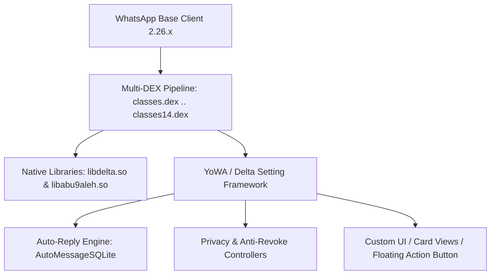

# Panduan Arsitektur WhatsApp Mod & Integrasi Bot Otomatis

## 1. Ikhtisar Arsitektur WhatsApp Mod (DeltaLabs / YoWA / Fouad)

Aplikasi modifikasi WhatsApp (seperti GB WhatsApp Delta oleh DeltaLabs) dibangun di atas decompiled base WhatsApp Messenger resmi (`com.whatsapp` atau `com.universe.messenger`) yang dipadukan dengan modul kustom:



### Komponen Utama di Dalam APK
1. **Multi-DEX Bytecode (14 File DEX)**:
   - `classes.dex` - `classes11.dex`: Logika inti WhatsApp (protokol E2EE, messaging pipeline, WebRTC voice/video).
   - `classes12.dex`: Framework YoWhatsApp (`com.whatsapp.youbasha`) dan modul pesan otomatis (`com.whatsapp.yo.autoschedreply.*`).
   - `classes13.dex` & `classes14.dex`: Kustomisasi DeltaLabs UI (`com.deltalabs.*`), pengatur tema, font kustom, dan listener unread badges.
2. **Pustaka Native (JNI / C++)**:
   - `libdelta.so` (6.1 MB): Engine rendering UI Delta, manajemen tema, dan manipulasi view Android.
   - `libabu9aleh.so`: Pustaka pendukung enkripsi dan utilitas media.
   - `libopustool.so` & `libsoundtouch.so`: Pengubah suara pesan suara (*voice note pitch/tempo*).

---

## 2. Struktur Modul Pesan Otomatis (*Auto-Reply Engine*)

Sistem balas otomatis internal di dalam GB WhatsApp Delta dikelola oleh kelas-kelas berikut di `classes12.dex`:

| Kelas Smali | Peran & Tanggung Jawab |
|---|---|
| `com.whatsapp.yo.autoschedreply.AutoMessageSQLite` | Helper SQLite untuk membuat dan mengelola tabel `automsg`. |
| `com.whatsapp.yo.autoschedreply.AddMessage` | Activity UI untuk input kata kunci trigger, balasan, dan delay. |
| `com.whatsapp.yo.autoschedreply.ListMessages` | Menampilkan daftar aturan pesan otomatis yang sedang aktif. |
| `com.whatsapp.yo.autoschedreply.Receiver` | BroadcastReceiver / Listener yang memicu balasan otomatis saat ada pesan masuk. |

### Skema Database SQLite Lokal (`automsg`)
Aturan disimpan secara lokal pada perangkat pengguna di:
`/data/data/com.universe.messenger/databases/`

```sql
CREATE TABLE automsg (
    _id INTEGER PRIMARY KEY AUTOINCREMENT,
    received_message TEXT,
    reply_message TEXT,
    recipients TEXT,
    reply_delay TEXT,
    pattern_matching TEXT,
    disabled INTEGER,
    start_time TEXT,
    end_time TEXT,
    specific TEXT,
    ignored TEXT
);
```

---

## 3. Strategi Integrasi Bot: Internal vs Multi-Device

Untuk menghadirkan bot WhatsApp dengan menu dan stiker, terdapat dua pendekatan arsitektur:

### A. Pendekatan Internal (In-App Auto-Reply)
- **Kelebihan**: Berjalan langsung di HP pengguna tanpa perlu server atau laptop menyala.
- **Batasan**: Hanya mendukung respon teks statis. Tidak mampu melakukan encoding grafis WebP 512x512 secara otomatis di latar belakang akibat pembatasan memori dan baterai Android (*Battery Optimization & Doze Mode*).

### B. Pendekatan Eksternal (Baileys Multi-Device Engine)
- **Kelebihan**:
  - Respon media penuh: konversi gambar/video ke Stiker WebP transparan via FFmpeg lokal.
  - Menu interaktif dinamis dengan logika JavaScript/Node.js.
  - Mampu melakukan *quote spoofing* (menampilkan kutipan pesan atas nama nomor virtual seperti `+999999999`).
- **Implementasi**: Nomor WhatsApp ditautkan melalui menu **Perangkat Tertaut (*Linked Devices*)** ke instance Baileys.

---

## 4. Prosedur Repacking, Alignment, dan Signing Aman

Saat memodifikasi APK WhatsApp:

1. **Integritas Format ZIP**:
   - Berkas `resources.arsc` **WAJIB** disimpan tanpa kompresi (`STORED`, flag `0x00`).
2. **Penyelarasan 4-Byte (Zipalign)**:
   - Gunakan `zipalign -f -p 4 unaligned.apk aligned.apk` untuk menjamin batas memori 4-byte dan alignment 4KB page bagi pustaka native `.so`.
3. **APK Signature Scheme V1, V2, V3**:
   - Android 11+ (API 30+) menolak APK yang hanya ditandatangani skema V1.
   - Gunakan `apksigner sign --v1-signing-enabled true --v2-signing-enabled true --v3-signing-enabled true`.
   - Validasi menggunakan: `apksigner verify -v output.apk`.

---

## 5. Pengujian & Deployment Otomatis via ADB & SCRCPY

Gunakan toolkit `whatsapp_mod_toolkit.py` bersama `scrcpy` untuk alur kerja cepat:

```powershell
# 1. Audit APK asli
python skills/apk-reverse/scripts/whatsapp_mod_toolkit.py audit --apk "C:\apk-reverse\apk\GB WHATSAPP DELTA TERBARU.apk"

# 2. Suntikkan konfigurasi bot dan kemas ulang APK
python skills/apk-reverse/scripts/whatsapp_mod_toolkit.py inject-bot --apk "C:\apk-reverse\apk\GB WHATSAPP DELTA TERBARU.apk" --out "C:\apk-reverse\apk\GB_WHATSAPP_DELTA_MODIFIKASI_PRO.apk"

# 3. Pasang langsung ke HP yang terhubung via ADB (scrcpy)
python skills/apk-reverse/scripts/whatsapp_mod_toolkit.py deploy --apk "C:\apk-reverse\apk\GB_WHATSAPP_DELTA_MODIFIKASI_PRO.apk"
```
