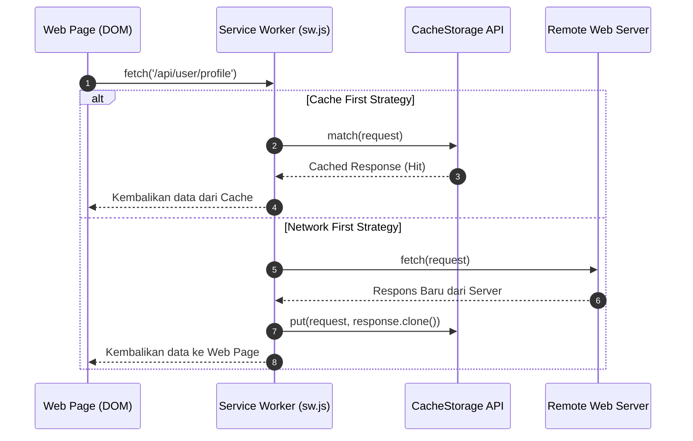

# Client Storage, Service Workers, and Offline Synchronization Reverse Engineering

> Panduan mendalam untuk menganalisis, membongkar (*reverse engineer*), dan memodifikasi penyimpanan lokal tingkat lanjut (*IndexedDB*, *LevelDB*, *Cache API*), intersep *Service Workers* (`sw.js`), serta ekstraksi state terenkripsi pada aplikasi web modern (SPA & PWA).

---

## 1. Arsitektur Penyimpanan Sisi Klien (Client Storage Hierarchy)

Aplikasi web modern (terutama PWA dan sistem komunikasi terenkripsi seperti Signal Web, Telegram Web, WhatsApp Web) tidak menyimpan data sensitif di `localStorage` teks biasa. Mereka mengandalkan hierarki penyimpanan multi-lapisan:

```
+-----------------------------------------------------------------------------------+
| 1. KEY-VALUE SIMPLE STORES                                                        |
|    - localStorage / sessionStorage: String UTF-16 sinkron (~5-10MB).              |
|    - Cookies: HTTP-only vs Javascript-accessible, SameSite flags, Host prefixes.  |
+-----------------------------------------------------------------------------------+
                                          |
                                          v
+-----------------------------------------------------------------------------------+
| 2. STRUCTURED ASYNC STORES (IndexedDB)                                            |
|    - Object Stores, Index B-Trees, Cursor Iterators.                             |
|    - Disimpan sebagai basis data LevelDB di disk Chromium/Firefox.                |
|    - Menyimpan objek kompleks (ArrayBuffer, Blob, CryptoKey, Date, Map/Set).      |
+-----------------------------------------------------------------------------------+
                                          |
                                          v
+-----------------------------------------------------------------------------------+
| 3. ASSET & NETWORK CACHING (Cache API / CacheStorage)                             |
|    - Request / Response pairs di bawah kendali Service Worker.                    |
|    - Menyimpan bytecode WebAssembly (.wasm), bundle JS ter-chunk, dan aset statis.|
+-----------------------------------------------------------------------------------+
                                          |
                                          v
+-----------------------------------------------------------------------------------+
| 4. BACKGROUND WORKERS (Service Workers & Worklets)                                |
|    - Berjalan di background thread independen di luar siklus hidup DOM.           |
|    - Mengintersepsi seluruh lalu lintas jaringan via event listener 'fetch'.      |
|    - Background Sync & Push Notification decryption.                              |
+-----------------------------------------------------------------------------------+
```

---

## 2. Reverse Engineering IndexedDB & LevelDB

### A. Lokasi Berkas di Penyimpanan Sistem Operasi
Pada peramban berbasis Chromium (Google Chrome, Microsoft Edge, Brave) di Windows/Linux:
```
# Path profil Chrome di Windows:
%LOCALAPPDATA%\Google\Chrome\User Data\Default\IndexedDB\<protocol>_<host>_<port>.indexeddb.leveldb\
```
Berkas di dalam folder ini adalah berkas basis data **LevelDB** (`.ldb`, `.log`, `CURRENT`, `MANIFEST`).

### B. Format Serialisasi: V8 Structured Clone
IndexedDB tidak menyimpan JSON teks biasa, melainkan representasi serialisasi internal mesin V8 (*V8 Structured Clone Algorithm*):
* Objek JavaScript biner, circular reference, dan objek biner (`Uint8Array`, `ArrayBuffer`) diserialisasikan secara efisien.
* Jika Anda membuka berkas `.ldb` secara mentah, Anda akan melihat header biner spesifik seperti tag versi V8 (`0xFF 0x09` atau `0xFF 0x0D`).

### C. Ekstraksi Data IndexedDB via DevTools Console
Gunakan snippet berikut di console DevTools untuk mendump seluruh isi tabel IndexedDB tanpa memerlukan ekstensi eksternal:

```javascript
async function exportFullIndexedDB(dbName) {
  return new Promise((resolve, reject) => {
    const req = indexedDB.open(dbName);
    req.onerror = () => reject(req.error);
    req.onsuccess = async () => {
      const db = req.result;
      const exportData = {};
      const tx = db.transaction(db.objectStoreNames, 'readonly');
      
      for (const storeName of db.objectStoreNames) {
        exportData[storeName] = await new Promise((resStore) => {
          const store = tx.objectStore(storeName);
          const getAllReq = store.getAll();
          getAllReq.onsuccess = () => resStore(getAllReq.result);
          getAllReq.onerror = () => resStore([]);
        });
      }
      console.log(`[✓] Berhasil mengekstrak ${db.objectStoreNames.length} object stores dari ${dbName}:`, exportData);
      resolve(exportData);
    };
  });
}
```

---

## 3. Service Workers (`sw.js`) Interception & Cache Tampering

Service Worker bertindak sebagai **proxy jaringan lokal** di dalam browser pengguna. Seluruh permintaan HTTP dari halaman web melewati handler `fetch` Service Worker:



### Jebakan Umum Analisis (*Pitfalls*):
* **Request Tidak Muncul di Network Tab:** Jika Service Worker mengembalikan data langsung dari `CacheStorage`, permintaan tersebut mungkin tidak memicu paket jaringan keluar sama sekali.
* **Inspect Service Worker Terpisah:** Service Worker memiliki thread dan console DevTools terpisah. Akses melalui:
  ```
  chrome://serviceworker-internals/
  atau DevTools -> Application -> Service Workers -> Inspect
  ```

### Bypass / Menonaktifkan Service Worker Sementara:
Di DevTools panel **Application** $\rightarrow$ **Service Workers**:
1. Centang **"Bypass for network"** untuk memaksa semua request melewati jaringan tanpa campur tangan handler `sw.js`.
2. Centang **"Update on reload"** agar script worker selalu diunduh ulang saat merefresh tab.

---

## 4. WebCrypto di Penyimpanan Lokal (Encrypted Client Storage)

Aplikasi web dengan keamanan tinggi mengenkripsi data sebelum menyimpannya ke dalam IndexedDB menggunakan Web Cryptography API (`window.crypto.subtle`):

### Pola Implementasi Umum:
1. Kunci privat (*CryptoKey*) disimpan dalam format *non-extractable* (`extractable: false`) di dalam IndexedDB.
2. Saat aplikasi melakukan boot, kunci dibaca dari IndexedDB dan digunakan untuk mendekripsi database lokal menggunakan algoritma AES-GCM (256-bit).

### Cara Menangkap Plaintext Sebelum Enkripsi / Setelah Dekripsi:
Alih-alih mencoba membobol enkripsi AES-GCM secara matematis, kaitkan (*hook*) fungsi `crypto.subtle` saat runtime:

```javascript
(function() {
  const origDecrypt = crypto.subtle.decrypt;
  crypto.subtle.decrypt = async function(algorithm, key, data) {
    const plaintextBuffer = await origDecrypt.apply(this, arguments);
    try {
      const decoded = new TextDecoder().decode(plaintextBuffer);
      console.log("[WEBCRYPTO DECRYPT]", {
        algorithm: algorithm,
        key: key,
        plaintext: decoded
      });
    } catch(e) {
      console.log("[WEBCRYPTO DECRYPT BINARY]", plaintextBuffer);
    }
    return plaintextBuffer;
  };

  const origEncrypt = crypto.subtle.encrypt;
  crypto.subtle.encrypt = async function(algorithm, key, data) {
    try {
      const decoded = new TextDecoder().decode(data);
      console.log("[WEBCRYPTO ENCRYPT]", {
        algorithm: algorithm,
        plaintext: decoded
      });
    } catch(e) {}
    return origEncrypt.apply(this, arguments);
  };
})();
```

---

## 5. Reverse Engineering State Manager (Redux, Zustand, Pinia)

Pada Single Page Application (React / Vue), state aplikasi biasanya dipegang oleh store global:

* **Redux / Redux Toolkit:** Cari objek `window.__REDUX_DEVTOOLS_EXTENSION__` atau periksa `store.getState()`.
* **Zustand:** Sering kali diekspos melalui store hook atau `window.store`.
* **Pinia / Vuex:** Dapat diakses pada instance root Vue:
  ```javascript
  // Akses root state Vue 3 Pinia:
  const app = document.querySelector('#app').__vue_app__;
  const pinia = app.config.globalProperties.$pinia;
  console.log("Pinia Stores:", pinia.state.value);
  ```

### Modifikasi State Secara Live:
Anda dapat mengubah state autentikasi atau kuota akun secara langsung dari console:
```javascript
// Contoh mengubah state pada store Zustand / Pinia
pinia.state.value.auth.isPremium = true;
pinia.state.value.user.role = 'administrator';
```
Perubahan state ini langsung memicu re-render reaktif pada komponen UI antarmuka web.
